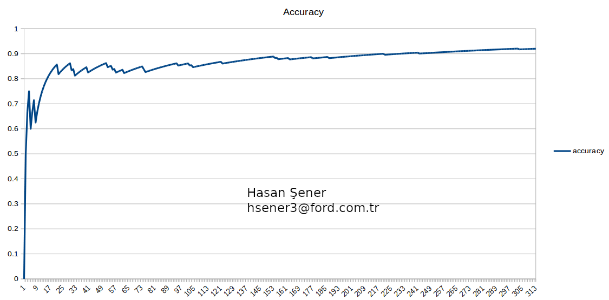

# Robotics Software Engineering ND Deep RL Arm Manipulation

## Introduction

This project aims to create a DQN agent and define a reward system to teach a robotic arm to complete these objectives: 

- Have any part of the robot arm touch the object of interest with at least 90% accuracy
- Have only the gripper of the robot arm touch the object at least 80% accuracy 

The project will success it's job by using Gazebo simulation environment and C++ Application Programming Interface (API). The project will simulate the with DQN agent. To accomplish the project complete software must satisfy: 

- Subscribe to camera and collision topics published by Gazebo 
- Crete the DQN agent and assign all parameters to it
- Define position depending to control function for arm joints 
- Reward and Penalize the simulation 
- Tune the hyper - parameters
- Reward the arm gripper with respect to position of the base and the object  

## Reward Functions

Deep Q-Network (DQN) output is generally mapped to a particular action, for this project it's the control of each joint for the simulated arm. Control of the joint movements may be velocity, position or both of them. In this project the position control was selected. 

Reward system was designed to train the manipulator to have any part of it touch the object of interest in one attempt then have the gripper base of the robot arm touch the object in a second attempt. 

The pseudo code for the system can be seen in the image below: 

```
'START 
10: IF new_image_from_camera = TRUE
20: 	update_robot_joints() 
30:		IF collision_detected = TRUE
40:			IF collision_with_target = TRUE
50: 			new_reward()
60:				GOTO 10
70:			ELSE
80:				new_penalty() 
90:				GOTO 10
100:	ELSE
110:		IF max_episode_length_reached = TRUE
120: 			new_penalty()
130:		ELSE IF arm_touched_ground = TRUE
140:			new_penalty()
150:		ELSE IF arm_distance_closer_to_target = TRUE
160:			new_interim_reward()
170:		ELSE 
180:			new_interim_penalty()
190:	GOTO 10
'END
```

Interim rewards and penalties are issued based on a smooth moving average of delta of the distance from the robot arm/gripper to the object of interest. The calculation of the values as follows: 

Distance Delta = Last Distance to Goal - Current Distance to Goal

Average Goal Delta = (Average Goal Delta * alpha) + (Distance Delta * (1.0 - alpha))

## Hyper parameters

Following parameters are tuned before the simulation to have good results from the DQN Agent. 

- **INPUT_WIDTH X INPUT_HEIGHT** : Since every camera frame, at every iteration, is supplied to DQN Agent. Since the agent makes the prediction and carries out an appropriate action, size of the input dimension hold as much as sufficient. **64x64** was fine and it did not cause negative impact on accuracy or performance issues. 
- **NUM_ACTIONS**: Based on the particular application, number of actions selected as 6. Because there are two actions per robot joint, one to *increase* either joint velocity or position yet the other one is to *decrease* the joint position or velocity. So the number of the robot selected as 2 x DOF. Where the DOF is 3 in our robot. 
- **OPTIMIZER**: There are many variations of gradient descent: Adam,RM Sprop, Adagrad, etc. all let you set the learning rate. in this project RM Sprop and Adam were tested and it produced similar results. RM- Sprop was used to obtain the required results.
- **LEARNING_RATE**: This parameters effects the learning directly. A low training value will be more reliable but it'll take time to learn also. This parameter taken as **0.01** for this application. 
- **REPLAY_MEMORY**: A cyclic buffer that stores the transitions that the DQN agent observes for later reuse by sampling from it randomly. This number was selected to be **10000** which means it will be possible to store
  10000/BATCH_SIZE.
- **BATCH_SIZE**: To prevent computer performance issues this is selected as **32**. Because the number of training examples equals batch size x number of iterations. 
- **USE_LSTM**: Long Short Term Memory (LSTM) as part of the DQN network will allow training the network by taking into consideration multipe past frames from the camera sensor instead of a single frame. In this project this parameter is enabled. 
- **REWARD_WIN**: This value was set to +300 that will be given when the target is touched by robot. 
- **REWARD_LOSS**: This value was set to -300 to deduct when the robot touch the ground or exceed the allowed limit of iterations per episode. 
- **REWARD_MULT**: Multiplier used to control the amount of points given in each interim reward or penalty based in distance from object of interest. Multiplier for the project was chosen to be 200 since the delta of distance was ranging from 0.4 to 1.4. 
- **alpha**: Smoothing factor to control average distance, alpha was decided to be 0.3 based on what was mentioned in project. 
- The other parameters were left unchanged. 

## Results

After tuning the parameters and setting the reward system well, DQN network took time to reach the objective. Accuracy was low until about 40 iterations. Within time the model learned well, over 300 iterations it was observed that 90% accuracy goal achieved. 

The accuracy over iteration figure can be seen below: 



Below image shows the values of accuracy, at 230th iteration the exact 90% of goal reached.


Finally, the robot in the environment is: 


## Future Work

After fine tuning the hyper parameters was quite good, however still the system needs to be improved. One approach is to graph the accuracy in real time with respect to changing parameters. 

DQN al so be used by itself to fine tune some of the parameters using with another DQN where reward can be taken from the first DQN's accuracy. 


